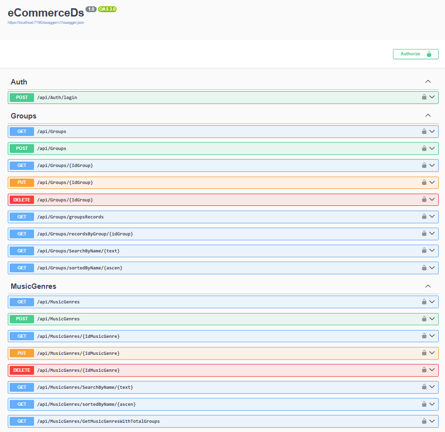
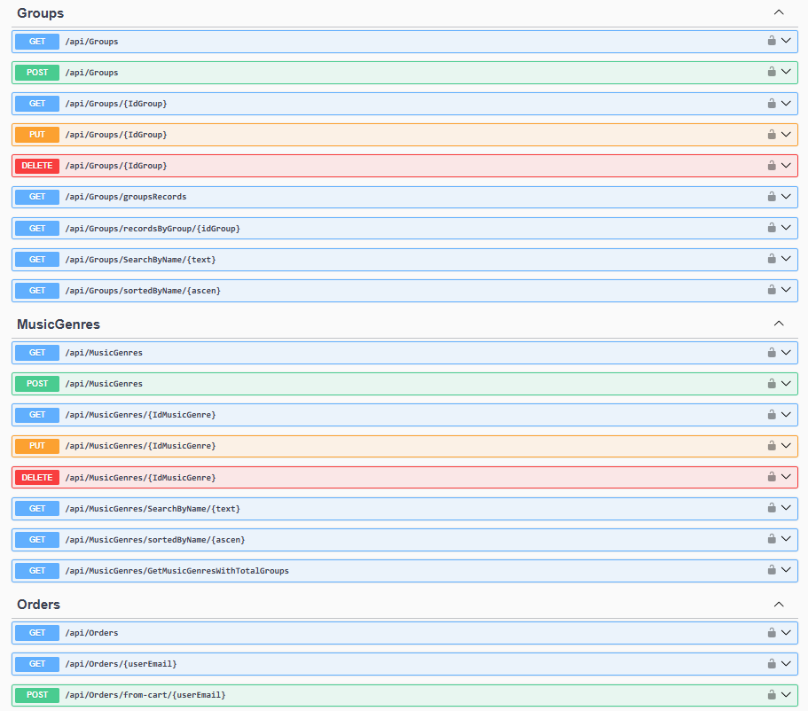
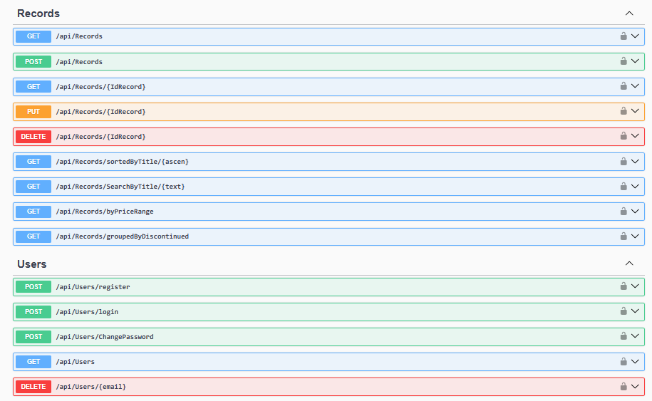

## eCommerceDs
ASP.NET Core Web API eCommerceDs






## Program
``` 
builder.Services.AddDbContext<AlmacenContext>(options =>
    options.UseSqlServer(builder.Configuration.GetConnectionString("Connection"))
);
``` 

## appsetting.Development.json
``` 
{
  "ConnectionStrings": {
        "Connection": "Server=*;Database=eCommerceDs;Trusted_Connection=True;TrustServerCertificate=True;MultipleActiveResultSets=True"
}
``` 